.. _example_30_Doradus_SOAR_March_2015:

30 Doradus SOAR March 2015
==========================

This data was acquired on March 2015 by Claudia Mendes de Oliveira, Philipe Amram, S. Torres and Bruno Quint.

The full set contains 35 data-taking runs, some of which are calibration and some are observation, according to the run notes::
  
  # Folder     Source   Filter    Image/Channel   # Sweeps   Binsize    z0:dz:nz  exptime  comments
  
  001          NeLamp  6600/20-BTFI      1            1        4x4      663:12:62    1    header for filter is incorrect, the correct filter is 6600/20 and not 6563/75 as the header says
  002          NeLamp  6600/20-BTFI      1            1        4x4      843:6:62      1    header for filter is incorrect, same as above
  003          NeLamp  6600/20-BTFI      1            1        4x4      842:6:62      1    header for filter is incorrect
  004          NeLamp  6600/20-BTFI      1            1        4x4      840:6:62      1    same as above
  005          NeLamp  6600/20-BTFI      1            1        4x4      836:6:62      1    same as above
  006          NeLamp  6600/20-BTFI      1            1        4x4     1229:7:62      1    same as above - BCV go down from 1229 to 809
  007          NeLamp  6600/20-BTFI      1            1        4x4     1203:7:62      1    same as above 
  008          NeLamp  6600/20-BTFI      1            1        4x4     1200:6:62      1    same as above
  009          NeLamp  6600/20-BTFI      1            1        4x4     1198:6:62      1    same as above
  010
  011          Bias                      1           40        4x4                    0    observation title is wrong - header says Calibration lamp - Ne but it is bias
  012          NeLamp  6600/20-BTFI      1            1        4x4     1200:6:42      1    now header is correct
  013          Neon Bulb 6600/20-BTFI    1            1        4x4     1200:6:46      1  
  014          NeLamp  6600/20-BTFI      1            1        4x4     1200:6:38      1
  015          NeLamp  6600/20-BTFI      1            1        4x4     1200:9:40      1
  016  12 5min darks
  017 8 x 8 
  018 skyflats 6568-20 1s exposures median counts = 30000 40 images
  019 skyflats 6578-19 1s exposures median counts = 35000 40 images - strange jet in the middle
  020 skyflats 6600-19 1s exposures median counts = 20000 40 images - strange crossed jets in the middle
  021 skyflats circular88 1s exposures
  022 skyflats 6578-19 1s 3000 counts still the same pattern
  023 skyflats 6578-19 3s
  024          30Dor    6568-20-2x2       1          1         4x4                  120.0 
  stopped the laser in frame 24
  stopped at frame 36 re-started the script (36b is bad given that it has high dark current)
  Finished with airmass 1.5
  025         NeLamp  6568/20-2x2      1            1        4x4     1200:9:40      1 we used the wrong filter - no lines
  026         Arp 244-Antennae 6600/20    1          1        4x4     1200:9:40     150.0  we stopped at the end of 8 given that there was an event and the laser had to be stopped
  027         Ne lamp 6600/20-BTFI        1          1        4x4     1200:9:40      1 wrong title
  T 03:15 UT03:31 cirrus AM final = 1.07
  028        Ne lamp 6600/20-BTFI         1          1        4x4     1200:9:40     1
  029        N3621  6578-19              1          1        4x4     1200:9:40     150.0 wrong title (it says pointing)
  030        N3621 - sky  6578-19        1          1        4x4     1200:9:40     10.0 wrong title
  4 arcminutes west of the galaxy
  031        NeLamp 6600/20-BTFI         1          1        4x4     1200:9:40     1   
  032        M17         6568-20         1          1        4x4     1200:9:40     80  wrong title
  033        NeLamp for M17 6600-19      1          1        4x4     1200:9:40     1  wrong ttle
  034        N10  Halpha image
  034        N10  R image
  035        flats for 6578-19 and 6600-19 (probably only last 2 are 6600-19)

The authors also provided the following parameters for the calibration::

  ## Based on cube015.fits at [153,578] (center)
  Wavelength: 6598.9529 A
  FSR_channel: 40.00 channels
  GFWHM_channels: 2.39 channels
  Center_channels: 18.67 channels
  
  ## Fabry-Perot information
  Gap size: 200 um = 2000000 A
  
  ## Order determination
  m(6598) = (2 * 200 um) / 6598.9529 A
  m(6598) = 606.156773751181
  
  ## FSR_wavelength
  FSR_wavelength = 6598.9529 A / m(6598)
  FSR_wavelength = 6598.9529 A / 606.156773751181
  FSR_wavelength = 10.886544844104602 A
  
  ## Sampling 
  Sampling = FSR_wavelength / FSR_channels = 10.886544844104602 A / 40 channels
  Sampling = 0.27216362110261505
  header['CRPIX3'] = 0.27216362110261505
  header['CD3_3'] = 0.27216362110261505
  header['C3_3'] = 0.27216362110261505
  
  ## Reference Pixel
  header['CRPIX3'] = round(Center_channels) = 19
  
  ## Reference Pixel value
  header['CRVAL3'] = 6598.9529 A +/- m * FSR_wavelength
  header['CRVAL3'] = 6598.9529 A - 3 * FSR_wavelength 
  header['CRVAL3'] = 6566.293265467686 A
  
  ## With this, we have the wavelength calibration:
  header['DISPAXIS']=3
  header['CRPIX3']  = 19
  header['CRVAL3']  = 6566.293265467686 A
  header['CRPIX3']  = 0.27216362110261505
  header['CD3_3']   = 0.27216362110261505
  header['C3_3']    = 0.27216362110261505

Run #001
--------

This run is a Neon lamp calibration, according to the notes.

The values for the parameter in the calibration ( calibration_wavelength, free_spectral_range, interference_order, interference_reference_wavelength, pixel_size, and scanning_wavelength ) were obtained from the parameter file.

The reduction was made using Tuna version 0.15.0. The code to reduce the image was::

  import numpy
  import time
  import tuna
  
  # 1. Read channels raw data and combine them in a cube.

  path = "/home/nix/fpdata_2015-09-11_Bruno_Quint_run_de_março/raw/001"
  counter = 277

  channels_files = { }
  for channel_index in range ( 62 ):
      file_index = channel_index + 1
      file_name = path + "/fp_sami_C0{:02d}".format ( file_index ) + "." + str ( counter + file_index ) + ".fits"
      channels_files [ channel_index ] = file_name

  channels_data = { }
  for key in channels_files.keys ( ):
      can = tuna.io.read ( channels_files [ key ] )
      channels_data [ key ] = can.array

  cube = numpy.ndarray ( shape = ( 62,
                         channels_data [ 0 ].shape [ 0 ],
                         channels_data [ 0 ].shape [ 1 ] ) )
  for key in channels_data.keys ( ):
      cube [ key ] = channels_data [ key ]

  # This cube has more than 1 FSR recorded; therefore we only need the planes for 1 full FSR.
  cube_1_fsr = cube [ 0 : 31 ]
      
  tuna.io.write ( array = cube_1_fsr, file_format = "fits", file_name = "run_001.fits" )

  # 2. Configure plugins for this reduction.
  tuna.plugins.registry ( "Overscan", tuna.tools.overscan.remove_elements )

  # 2. Reduce the raw cube.

  def reduce_calibration ( file_name ):
      file_object = tuna.io.read ( file_name )
      start = time.time ( )
      reducer = tuna.pipelines.calibration_lamp_high_resolution.reducer (
          calibration_wavelength = 6566.293265467686,
          finesse = 12,
          free_spectral_range = 10.886544844104602,
          interference_order = 606.156773751181,
          interference_reference_wavelength = 6598.9529,
          pixel_size = 19,
          scanning_wavelength = 6598.9529,
          tuna_can = file_object,
          channel_subset = [ 0, 1, 2, 5 ],
          continuum_to_FSR_ratio = 0.125,
          noise_mask_radius = 8,
          dont_fit = False,
          overscan_removal = { 2 : list ( range ( 16 ) ) + list ( range ( 527, 561 ) ) + list ( range ( 1072, 1088 ) ) },
          unwrapped_only = False,
          verify_center = None )
  reducer.join ( )
  print ( "Tuna took {:.1f}s to reduce.".format ( time.time ( ) - start ) )
  reducer.plot ( )
  return reducer

  pipeline_result = reduce_calibration ( "run_001.fits" )
  
Output from ipython was::

  $ ipython -i ~/example_Dor30_SOAR.py
  FITS file written at run_001.fits.
  Plugin for "Overscan" set to tuna.tools.overscan.remove_elements.
  Starting tuna.pipelines.calibration_lamp_high_resolution pipeline.
  Continuum array created.
  Barycenter done.
  Noise map created with lower_value = 128880.0.
  len ( pixel_set_intersections ) == 0, falling back to whole pixel_set
  averaged_concentric_rings = ((581.67385168909686, 161.02864583854762), [805.08615077802199, 126.54220326235794], [0, 1])
  sorted_radii = ['126.54', '805.09']
  inital_gap = 1.99e+06 microns
  channel_gap = -2.2923780482622886 microns.
  Airy <|residue|> = 2304.3 photons / pixel
  Phase map unwrapped.
  Wavelength calibration done.
  Parabolic model fitted.
  Tuna took 1542.8s to reduce.

The plots produced in the run were the following:
  
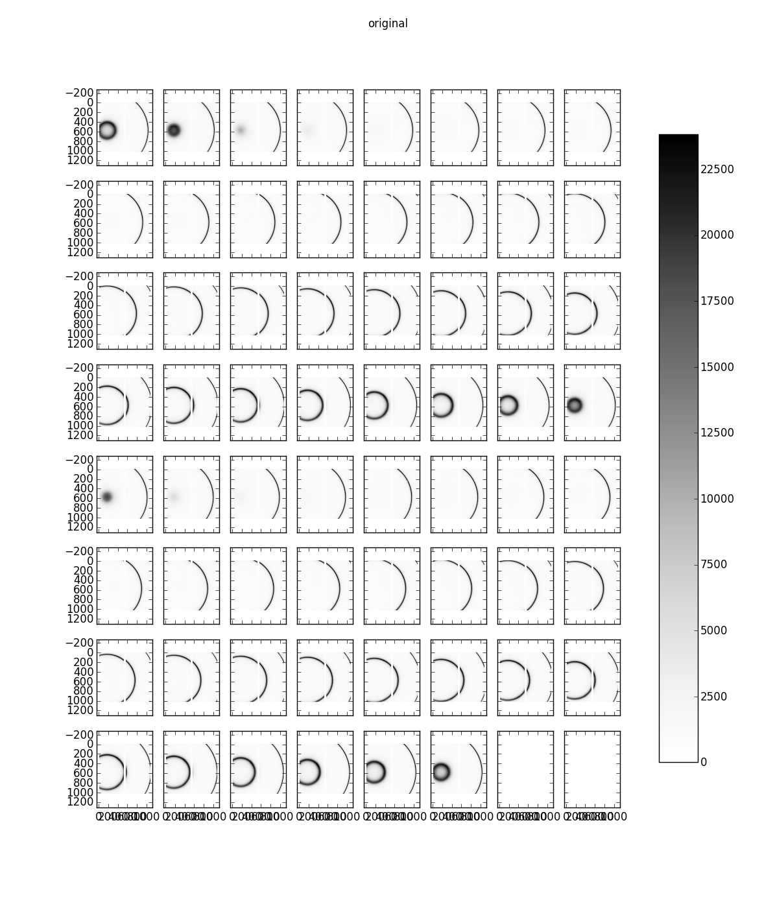
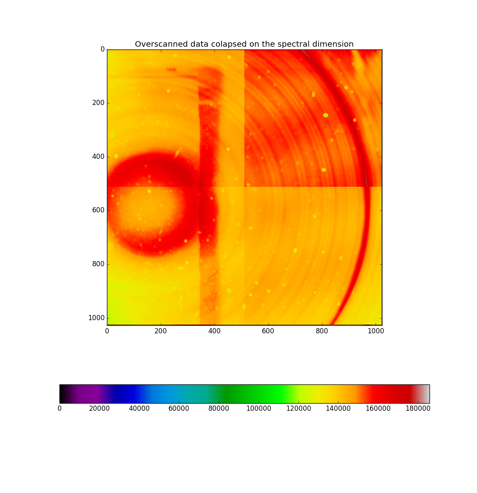
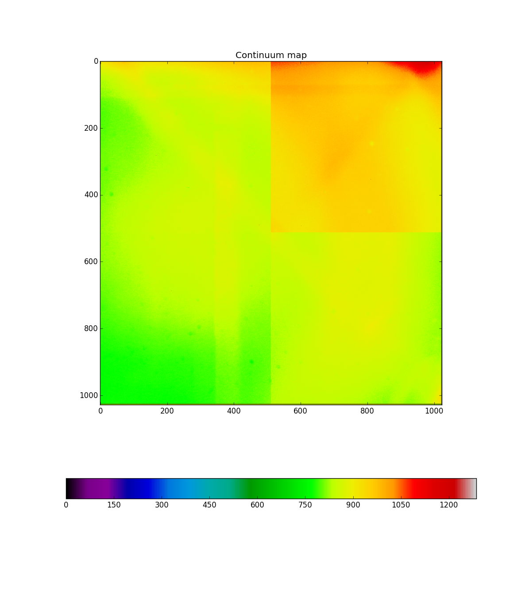
.. image:: images/example_Dor30_SOAR_4.png
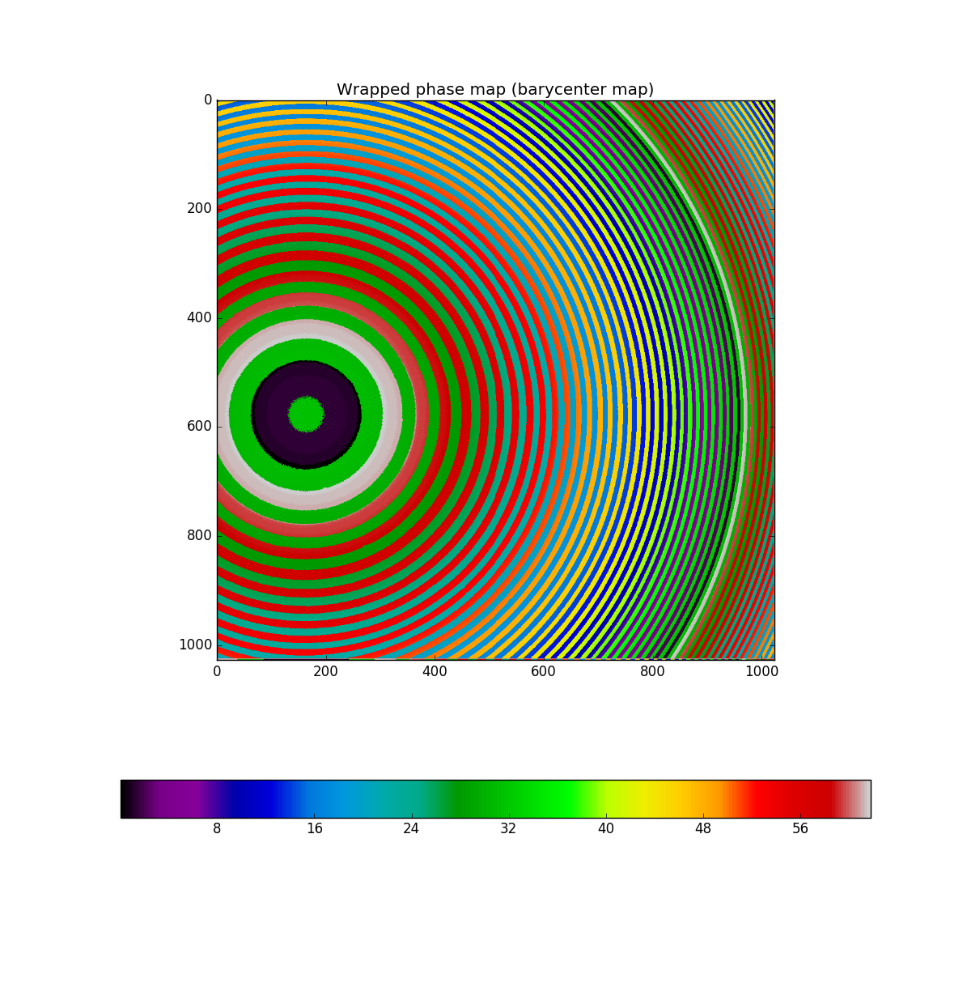
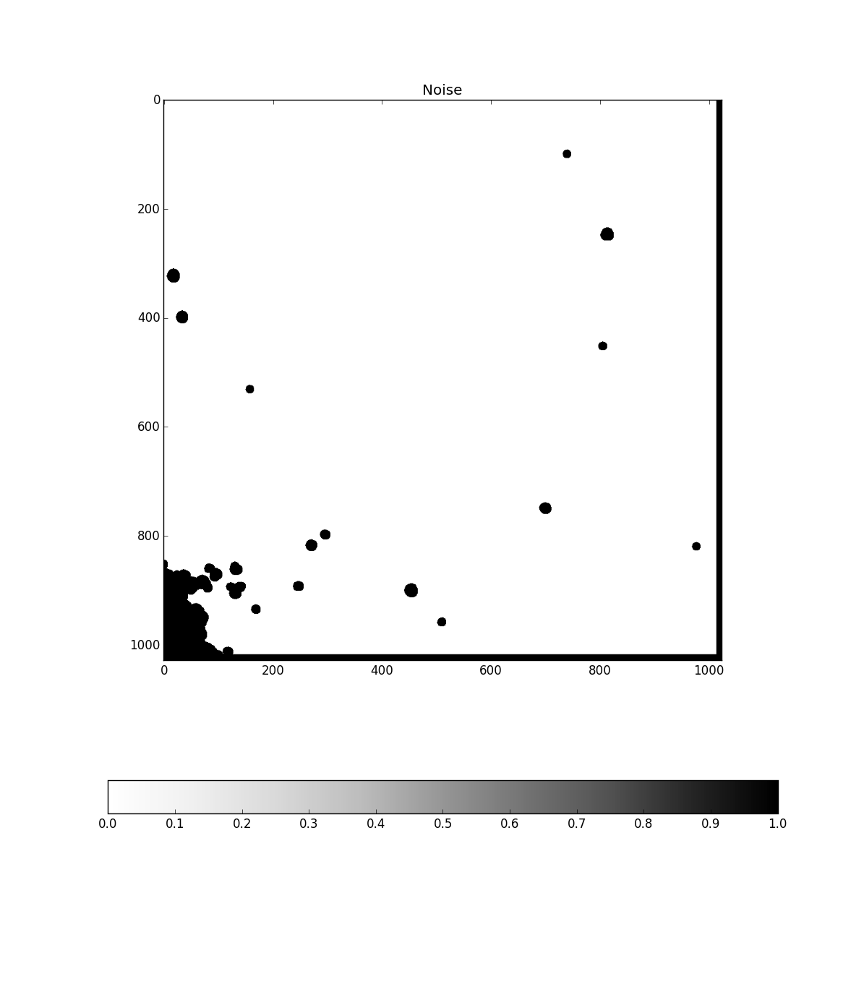
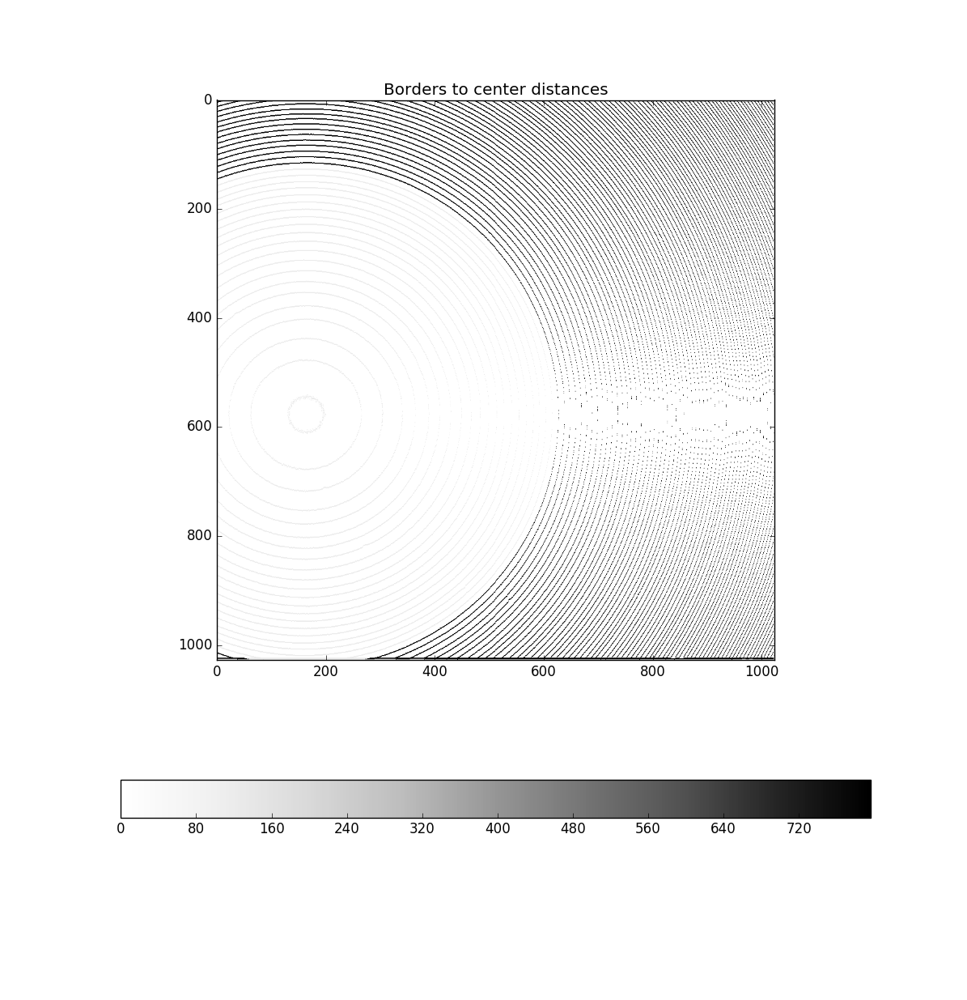

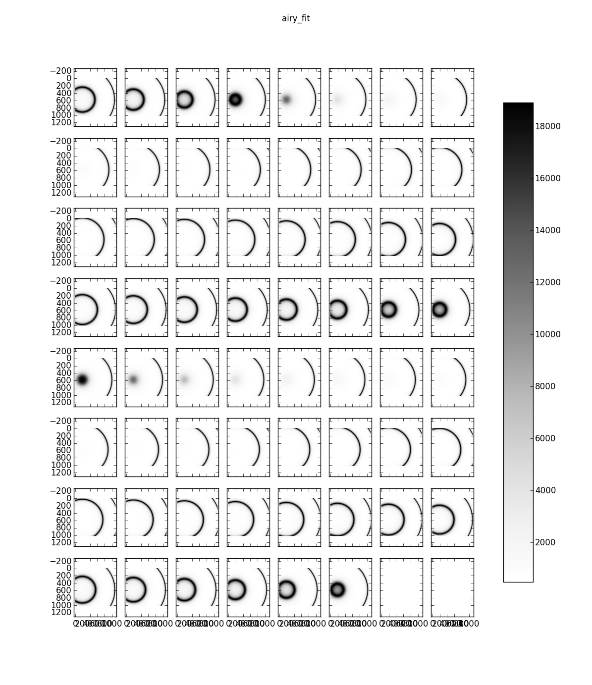
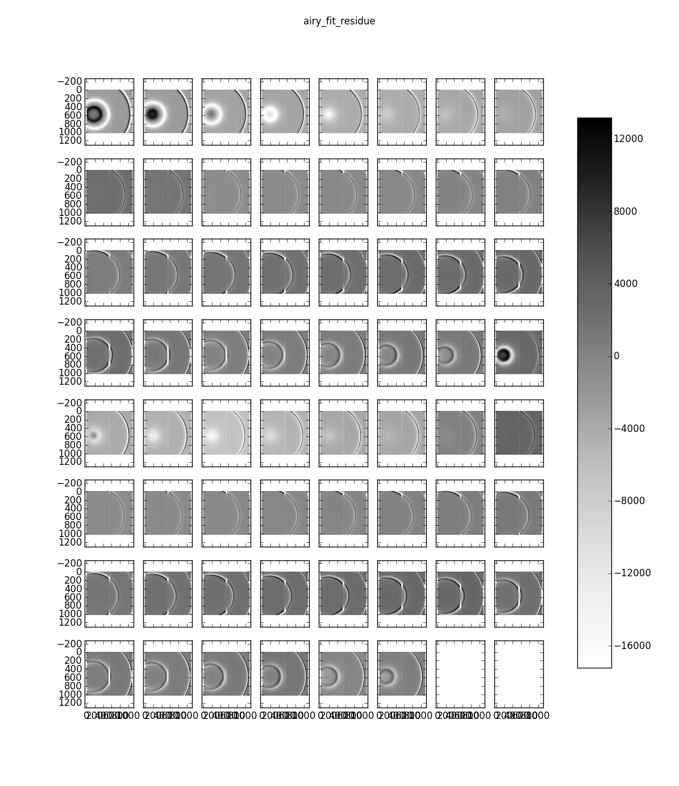
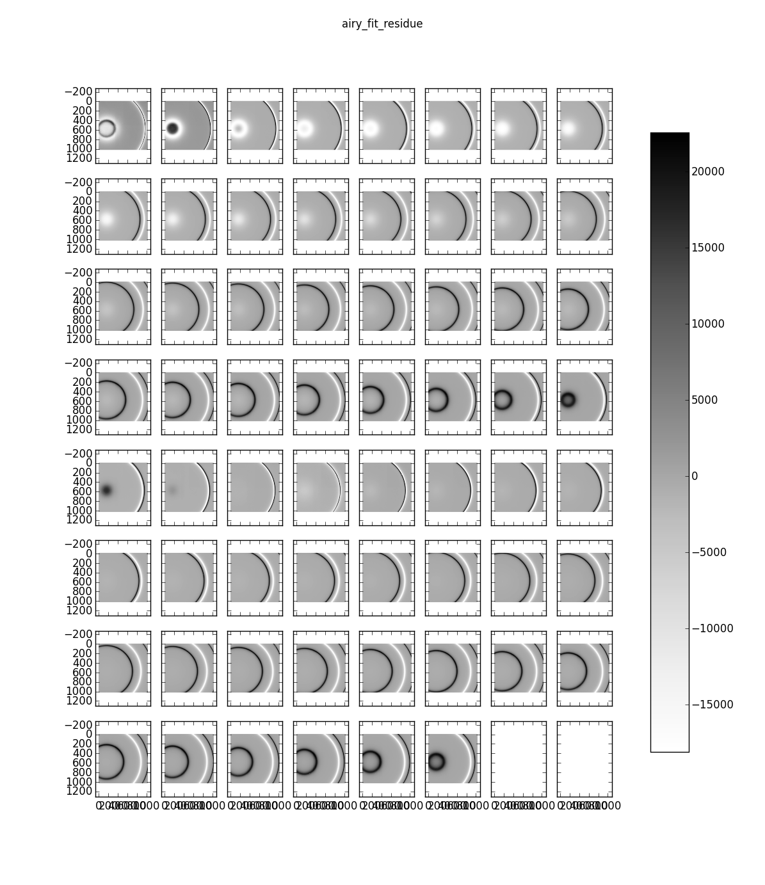
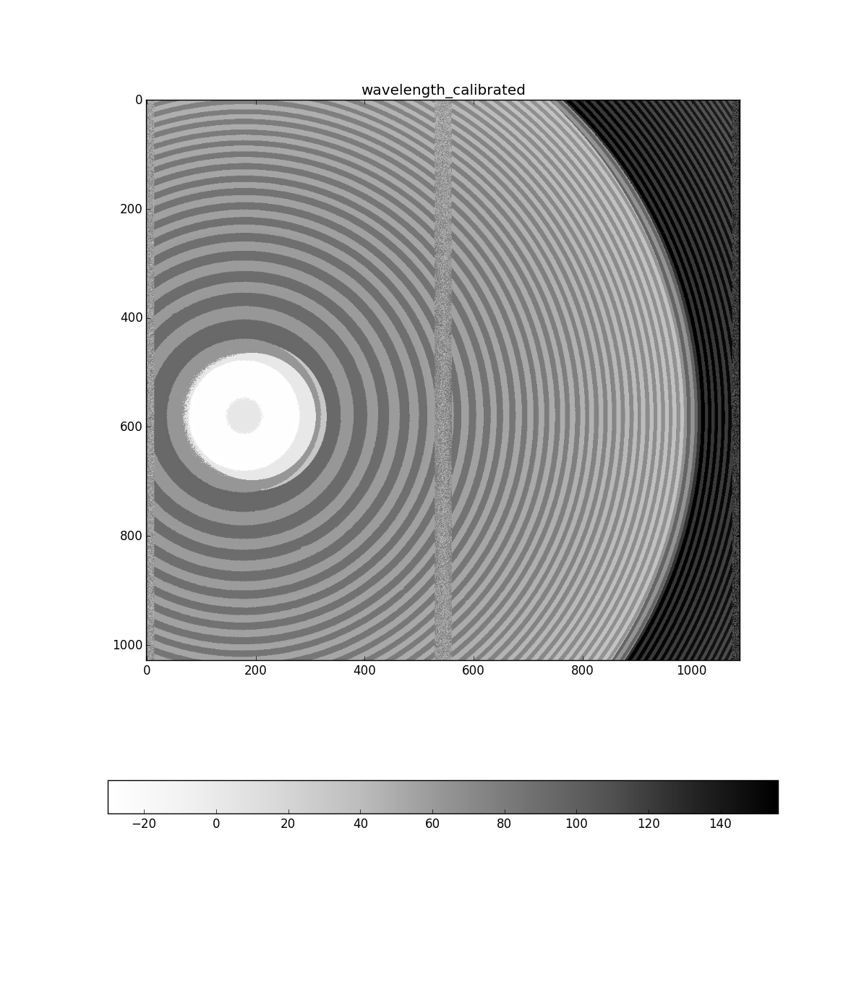
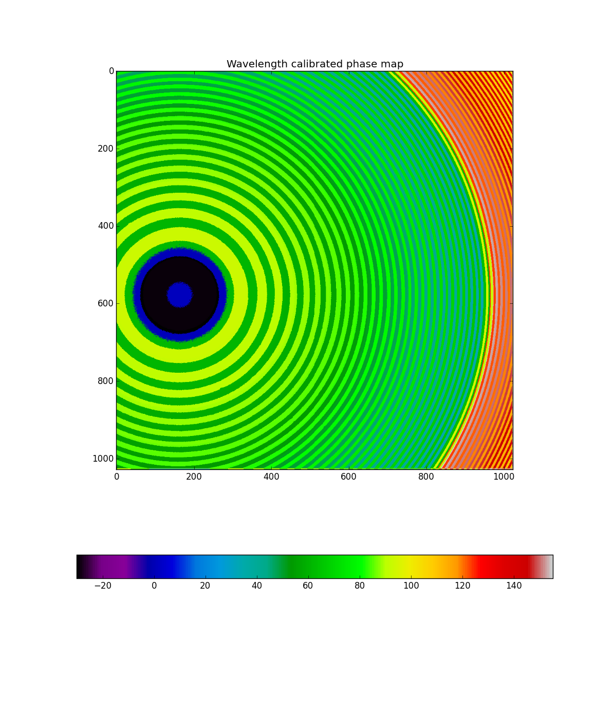
