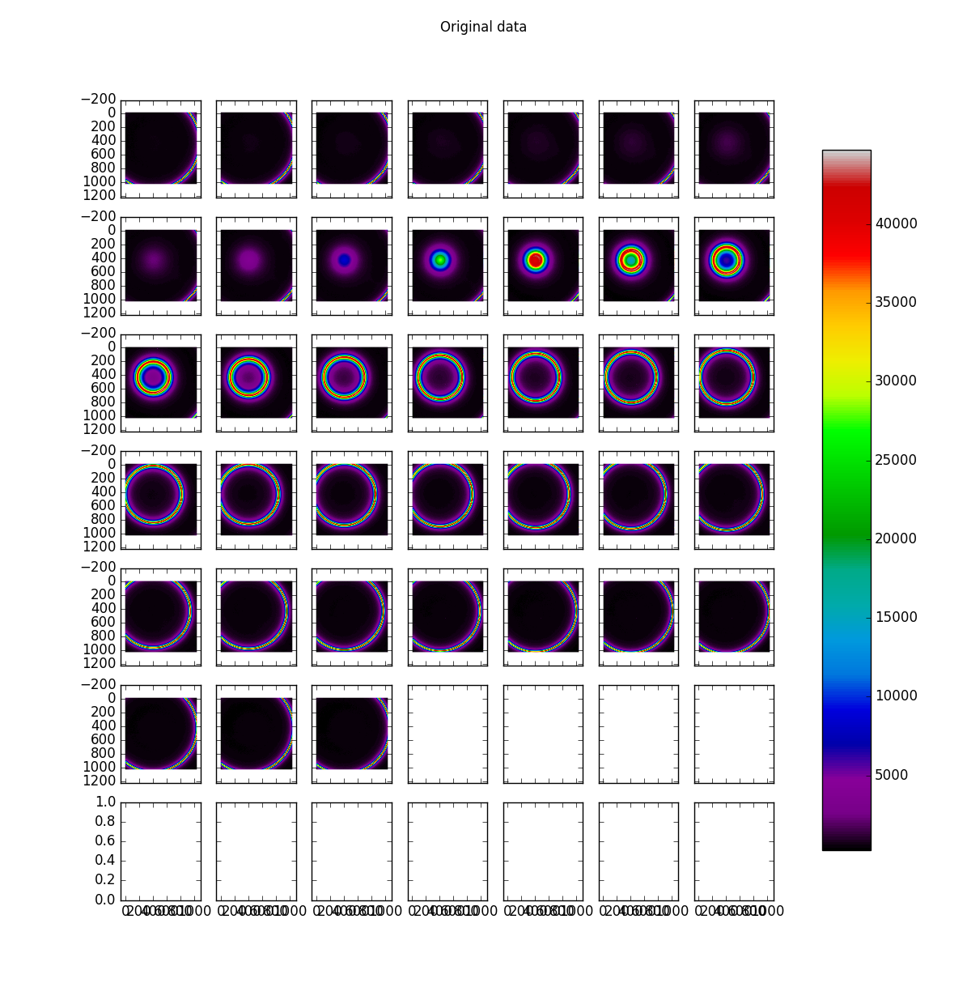
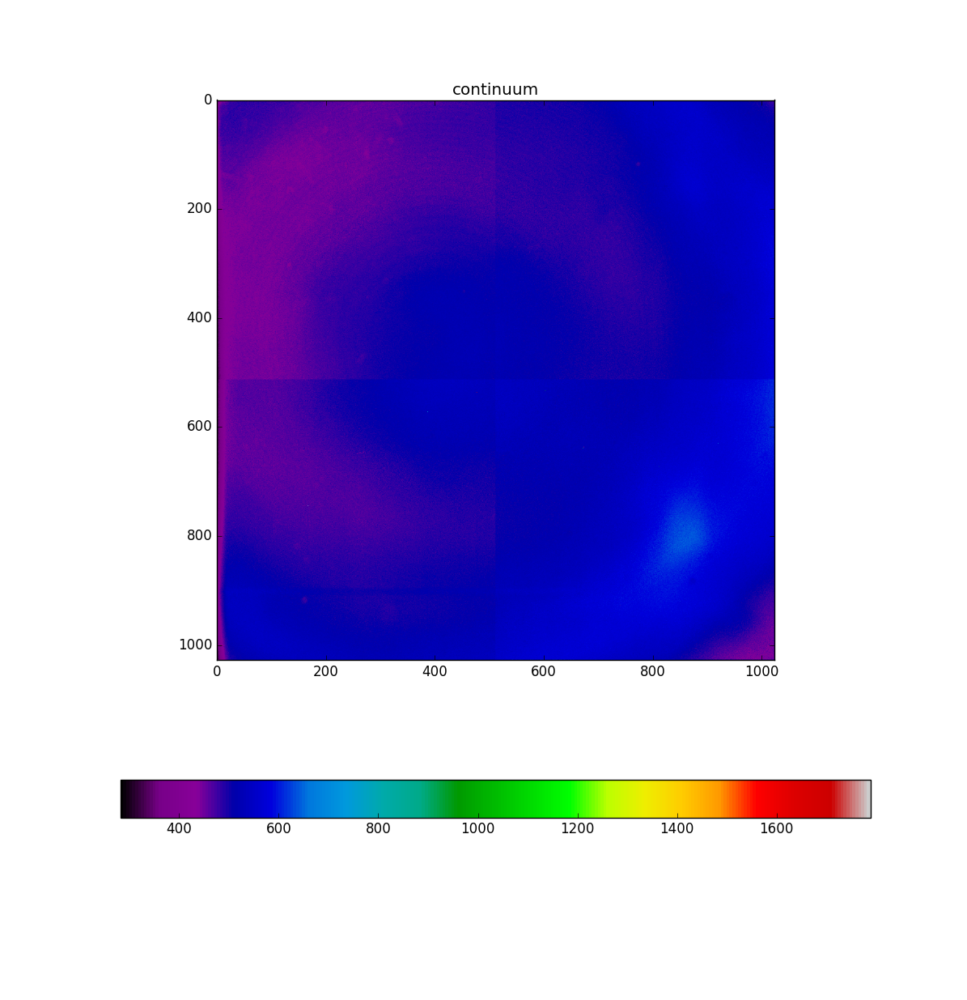
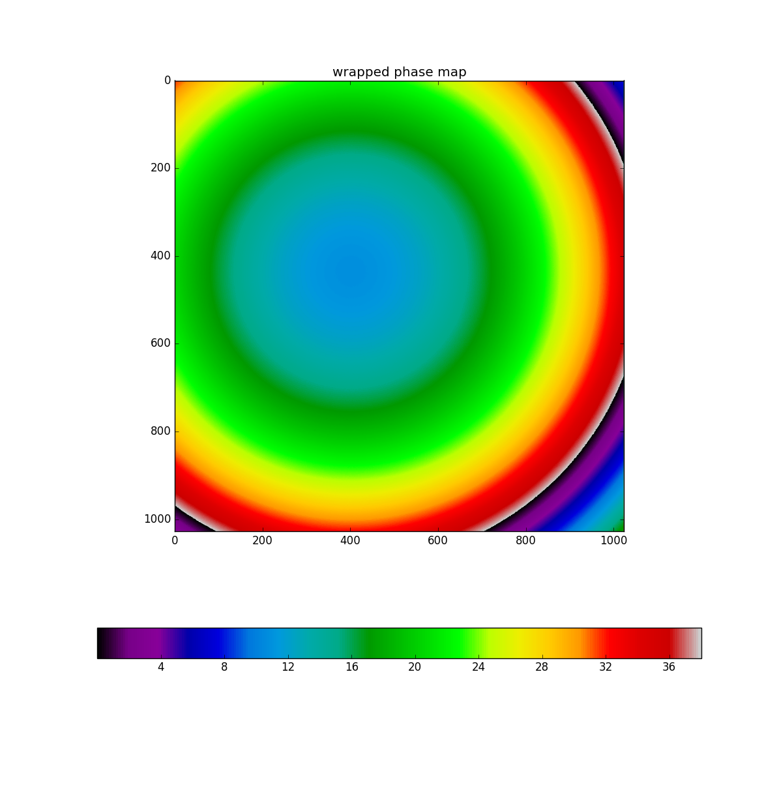
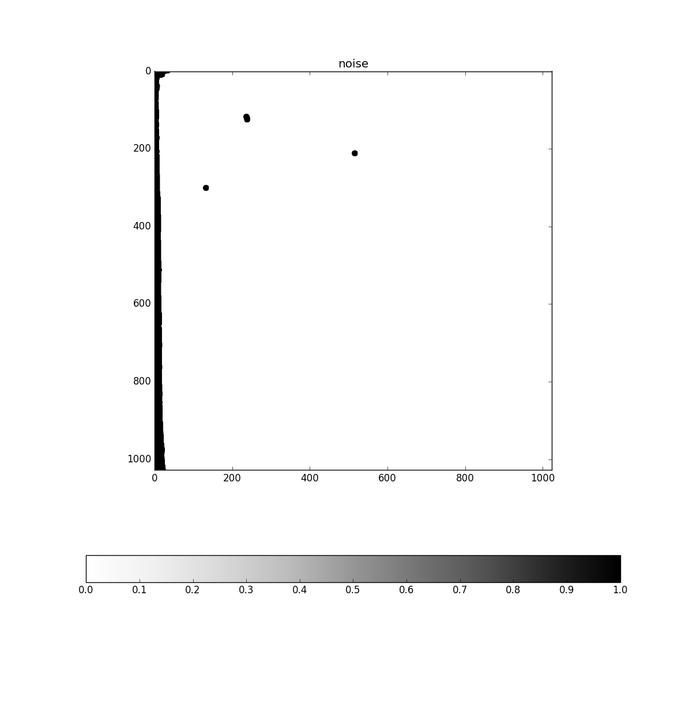
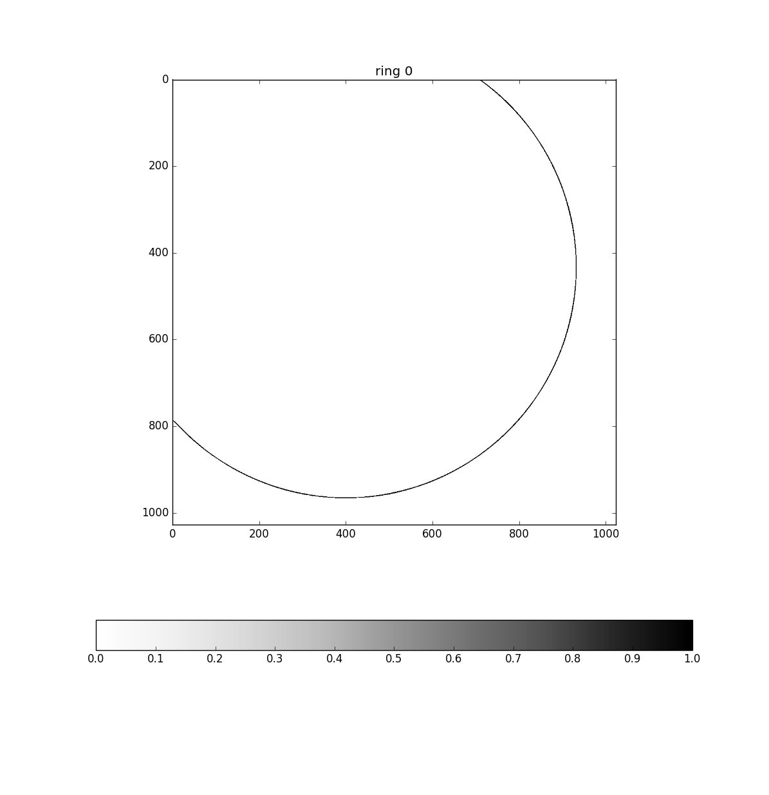
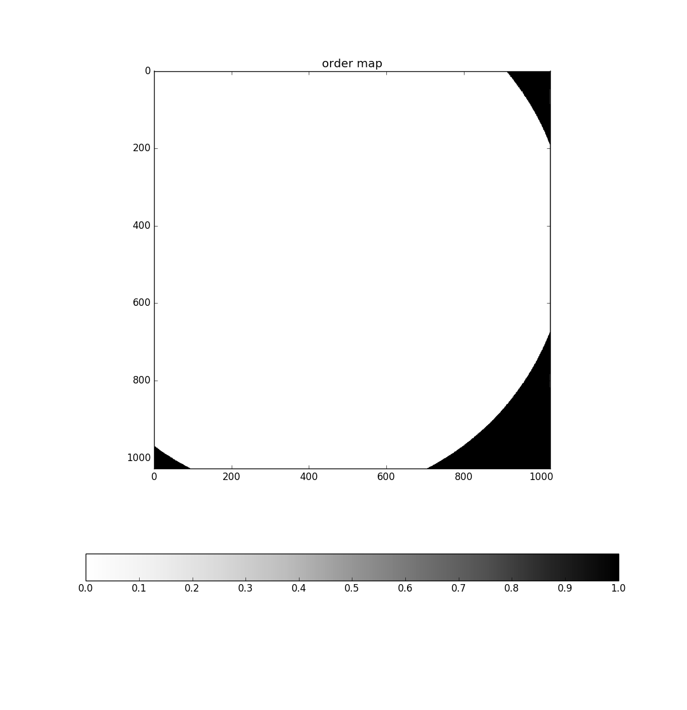
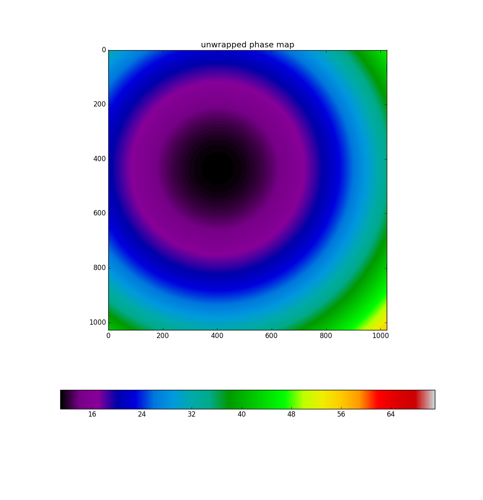

.. _example_SOAR_2:

SOAR 2016-01-14
===============

This data was provided to me on January 2016 by Philipe Amram. Who also provided the following parameters for the calibration::

  calibration_wavelength = 6598.953125
  finesse = 26
  free_spectral_range_A = 11.410
  interference_order = 609
  interference_reference_wavelength_A = 6562.7797852
  pixel_size_micron = 15
  scanning_wavelength_A = 6760.89

The reduction was made using Tuna version 0.16.4. The code to reduce the image was::

  import tuna
  
  tuna.log.set_path ( "/home/nix/tuna.log" )
  tuna.log.verbose ( "file", "DEBUG" )
  tuna.log.verbose ( "console", "INFO" )
  
  def reduce_calibration ( can ):
    reducer = tuna.pipelines.calibration_lamp_high_resolution.reducer (
      best_ring_plane = 28,
      calibration_wavelength = 6598.953125,
      finesse = 26,
      free_spectral_range = 11.410, # computed at the interference_reference_wavelength_A
      interference_order = 609, # computed at the interference_reference_wavelength_A        
      interference_reference_wavelength = 6562.7797852,
      min_rings = 1,
      pixel_size = 15, # in microns
      scanning_wavelength = 6760.89,
      channel_subset = [ ],
      continuum_to_FSR_ratio = 0.25,
      noise_mask_radius = 8,
      dont_fit = False,
      tuna_can = can, 
      unwrapped_only = False,
      verify_center = None )
  reducer.join ( )
  return reducer
  
  cube = tuna.io.read ( "/home/nix/store/fpdata_SOAR_Philippe_Amram_2016-01-14/cal.ad3" )
  pipeline_result = reduce_calibration ( cube )
  tuna.tools.plot_high_res ( pipeline_result )
  
Output from ipython was::

  Log file set to /home/nix/tuna.log.
  Handler <logging.FileHandler object at 0x7f883964bba8> set to 10.
  Handler <logging.StreamHandler object at 0x7f883964b240> set to 20.
  Successfully read adhoc 3d object from file /home/nix/store/fpdata_SOAR_Philippe_Amram_2016-01-14/cal.ad3.
  Starting tuna.pipelines.calibration_lamp_high_resolution pipeline.
  Continuum array created.
  Barycenter done.
  Noise map created with lower_value = 99658.8896875.
  Concentric rings structure: ((433.5, 398.5), [532.61289882991002], [0])
  Fitted rings to plane 28.
  Airy fitting requires at least 2 concentric rings. Blocking request to fit data.
  sorted_distances == [665.9958708580707]
  Phase map unwrapped.
  Wavelength calibration done.
    
The plots produced in the run were the following:
  

.. image:: images/example_SOAR_2_3.png

.. image:: images/example_SOAR_2_7.png

