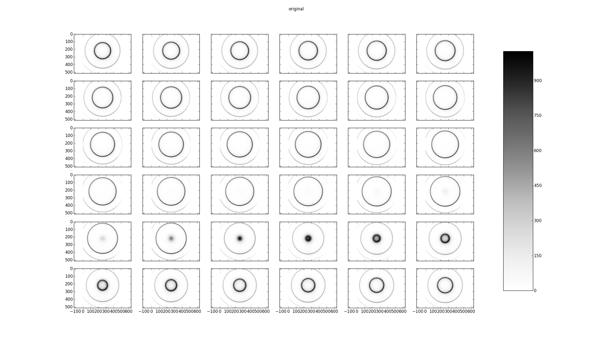
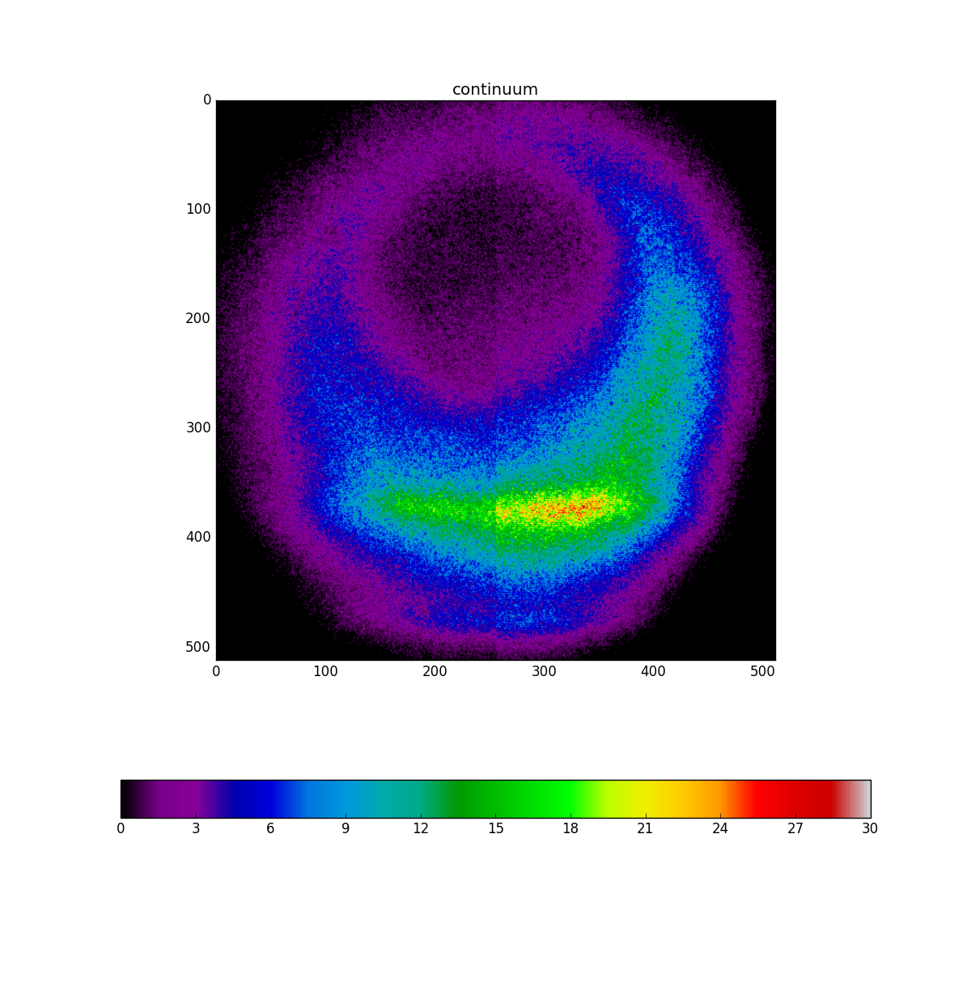
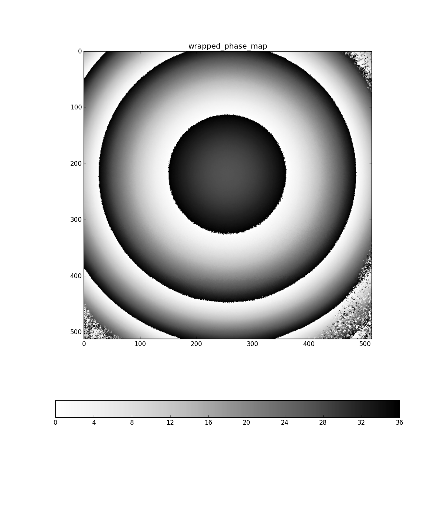
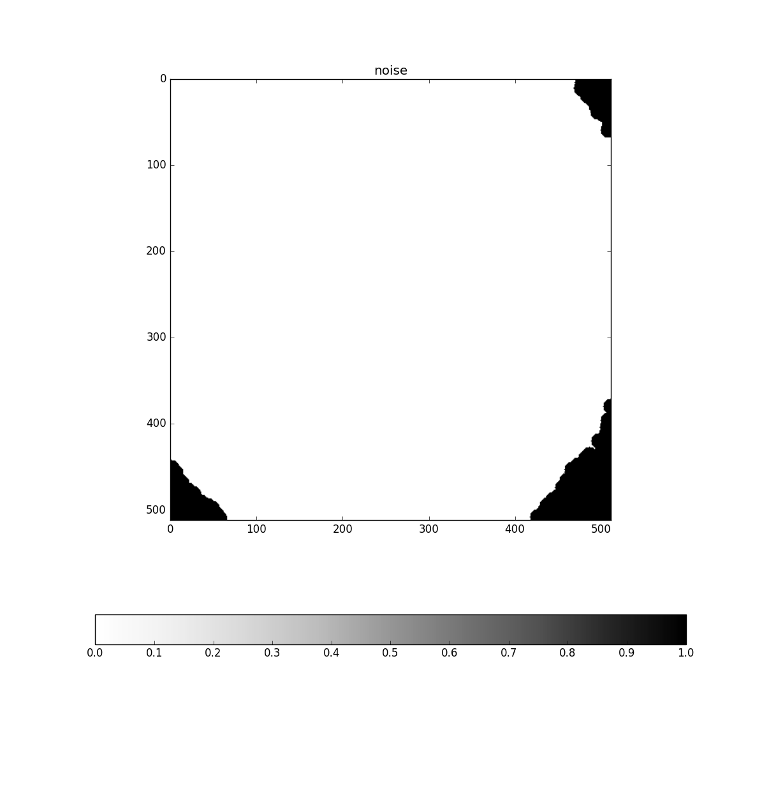
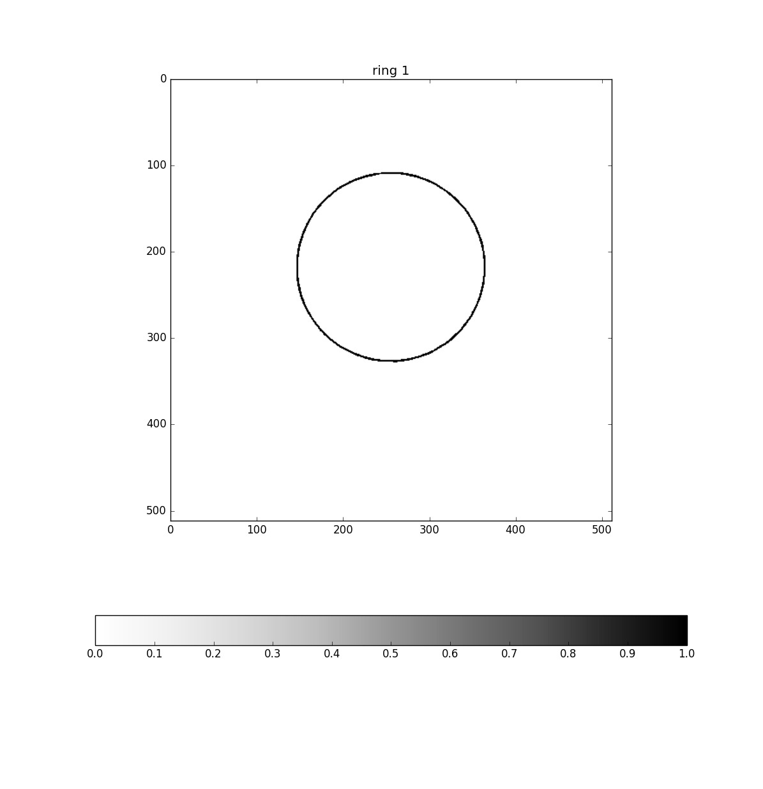
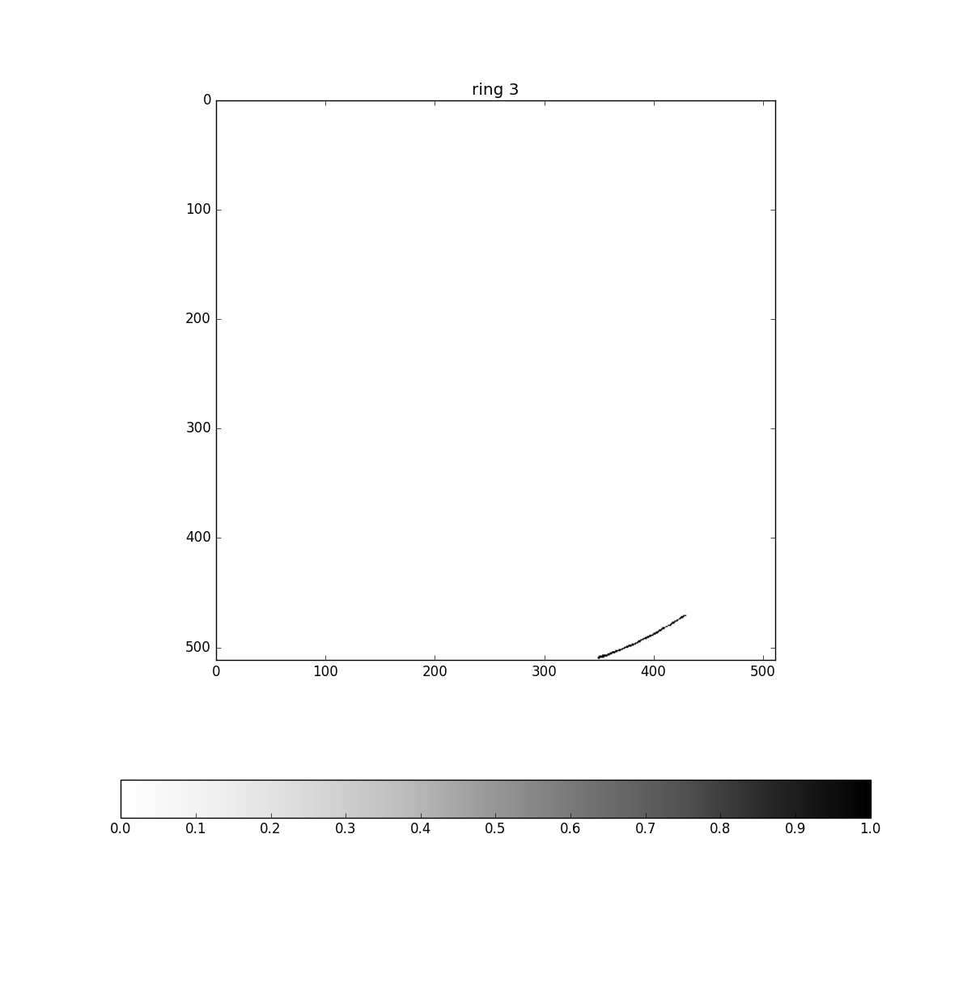
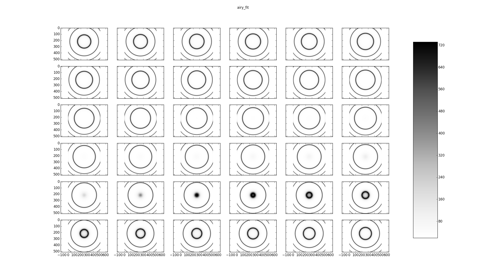
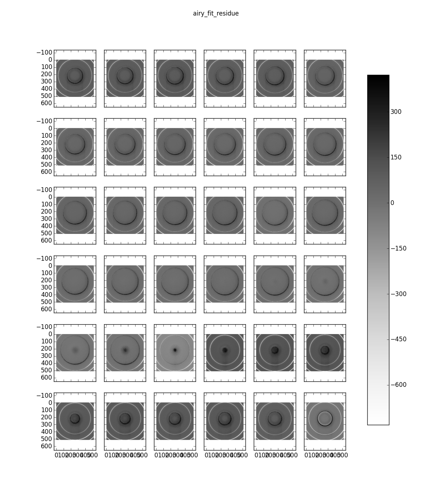
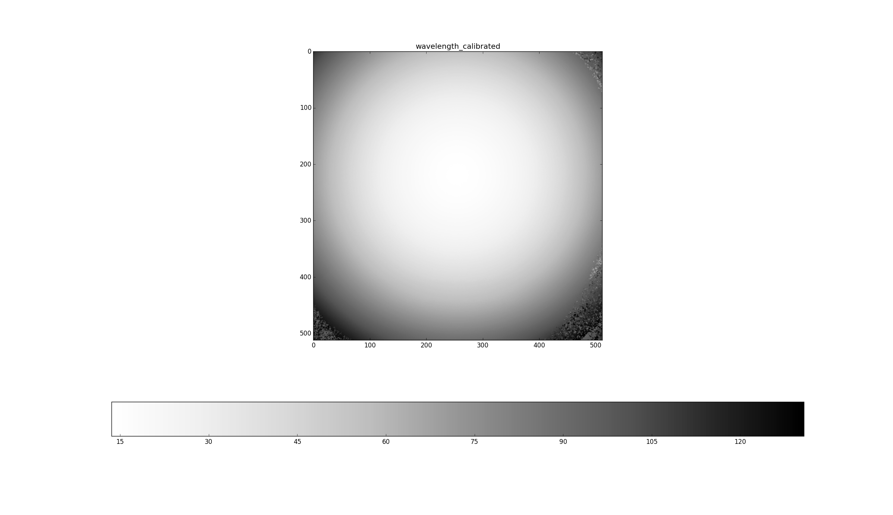

.. _example_g092_label:

Calibration lamp NGC772 G092
============================

This data cube was supplied by Benoît Epinat and corresponds to the spectrograph of a calibration lamp imaged before data aquisition in a run made to observe NGC772.

The reduction was made using Tuna v0.11.0.

The code for reducing it was::

  import time
  import tuna
  tuna.log.set_path ( "test.log" )
  tuna.log.verbose ( "file", "DEBUG" )
  
  def reduce_test ( file_name ):
      file_object = tuna.io.read ( file_name )
      start = time.time ( )
      reducer = tuna.tools.phase_map.high_resolution (
          calibration_wavelength = 65989.53125,
          finesse = 12,
          free_spectral_range = 8.36522123894,
          interference_order = 791,
          interference_reference_wavelength = 65627.797852,
          pixel_size = 9,
          scanning_wavelength = 66168.9,
          tuna_can = file_object,
          wrapped_algorithm = tuna.tools.phase_map.barycenter_fast,
          channel_subset = [ 0, 1, 2, 5 ],
          continuum_to_FSR_ratio = 0.125,
          noise_mask_radius = 8,
          dont_fit = False,
          unwrapped_only = False,
          verify_center = None )
      reducer.join ( )
      print ( "Tuna took {:.1f}s to reduce.".format ( time.time ( ) - start ) )
      reducer.plot ( )
      return reducer
      
      test = reduce_test ( "/home/nix/cold_store/fpdata_NGC772_Benoit_Epinat_2014-11-05/G092/G092.AD3" )

