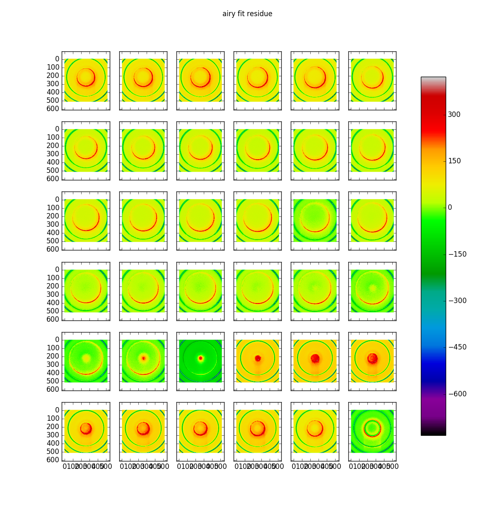
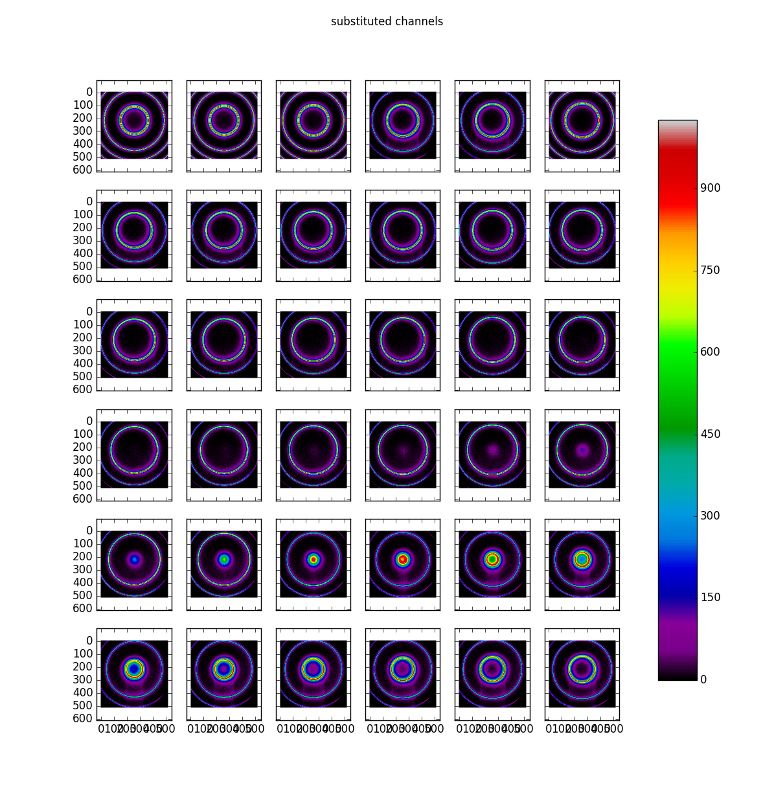
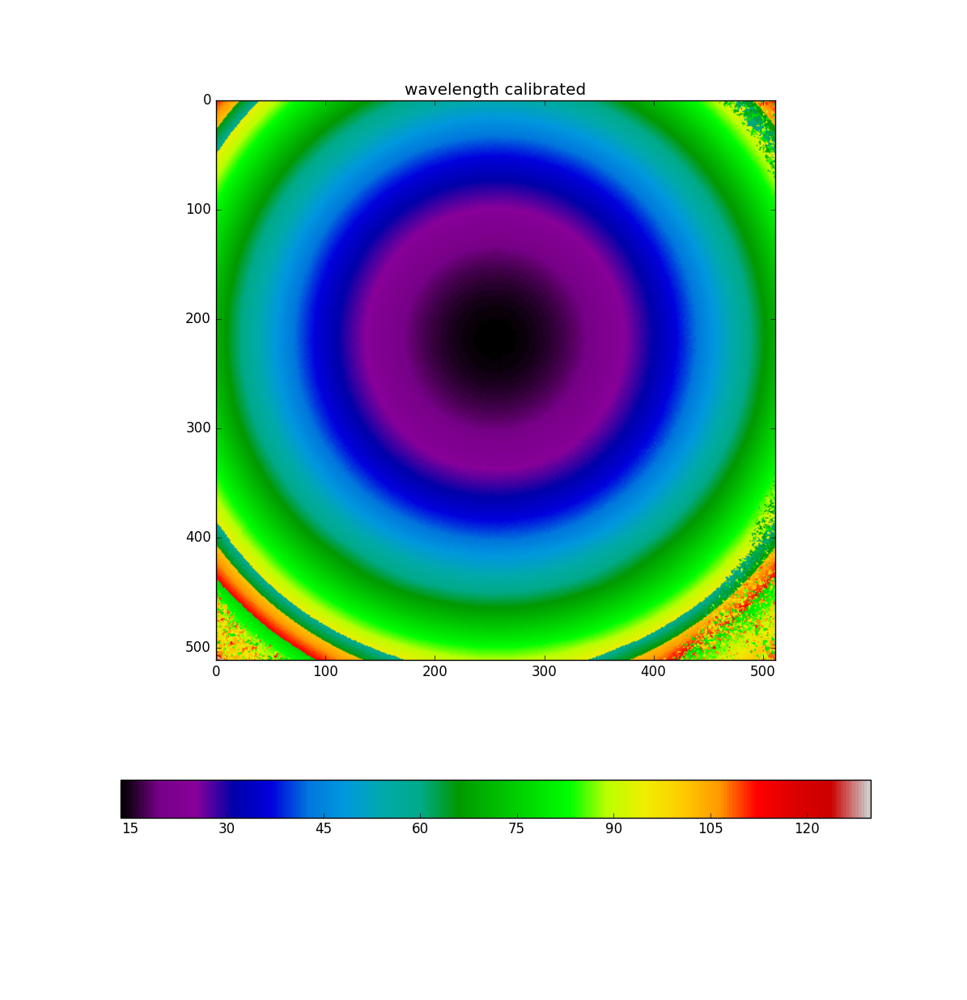

.. _example_g092_label:

Calibration lamp NGC772 G092
============================

This data cube was supplied by Benoît Epinat and corresponds to the spectrograph of a calibration lamp imaged before data aquisition in a run made to observe NGC772.

The reduction was made using Tuna v0.16.4.

The code for reducing it was::

  import time
  import tuna
  tuna.log.set_path ( "test.log" )
  tuna.log.verbose ( "file", "DEBUG" )
  
  def reduce_test ( file_name ):
    file_object = tuna.io.read ( file_name )
    start = time.time ( )
    reducer = tuna.pipelines.calibration_lamp_high_resolution.reducer (
      calibration_wavelength = 6598.953125,
      finesse = 12,
      free_spectral_range = 8.36522123894,
      interference_order = 791,
      interference_reference_wavelength = 6562.7797852,
      pixel_size = 9,
      scanning_wavelength = 6616.89,
      tuna_can = file_object,
      channel_subset = [ 0, 1, 2, 5 ],
      continuum_to_FSR_ratio = 0.125,
      noise_mask_radius = 9,
      dont_fit = False,
      unwrapped_only = False,
      verify_center = None )
    reducer.join ( )
    print ( "Tuna took {:.1f}s to reduce.".format ( time.time ( ) - start ) )
    return reducer
  
  test = reduce_test ( "/home/nix/cold_store/fpdata_NGC772_Benoit_Epinat_2014-11-05/G092/G092.AD3" )
  tuna.tools.plot_high_res ( test )

The output from running it was::

  Log file set to test.log.
  Handler <logging.FileHandler object at 0x7f20187c3860> set to 10.
  Successfully read adhoc 3d object from file /home/nix/cold_store/fpdata_NGC772_Benoit_Epinat_2014-11-05/G092/G092.AD3.
  Starting tuna.pipelines.calibration_lamp_high_resolution pipeline.
  Continuum array created.
  Barycenter done.
  Noise map created with lower_value = 4.0.
  Searching for concentric rings in plane 0.
  Concentric rings structure: ((216.70845070644381, 256.06969280465921), [231.99294249957384, 109.89700028991167, 310.27998456965793], [0, 1, 2])
  Ring structure obtained from plane where borders occupy 28% of the array.
  sorted_radii = ['109.90', '231.99', '310.28']
  inital_gap = 2.61e+06 microns
  channel_gap = 31.5815982991933 microns.
  Airy <|residue|> = 35.4 photons / pixel
  sorted_distances == [101.97874125187644, 226.0981120852606, 349.79260244157507]
  Phase map unwrapped.
  Wavelength calibration done.
  Parabolic model fitted.
  Tuna took 146.4s to reduce.

.. image:: images/example_g092_1.png
.. image:: images/example_g092_2.png
.. image:: images/example_g092_3.png
.. image:: images/example_g092_4.png
.. image:: images/example_g092_5.png
.. image:: images/example_g092_6.png
.. image:: images/example_g092_7.png
.. image:: images/example_g092_8.png
.. image:: images/example_g092_9.png
.. image:: images/example_g092_10.png
.. image:: images/example_g092_11.png
.. image:: images/example_g092_12.png
.. image:: images/example_g092_13.png

